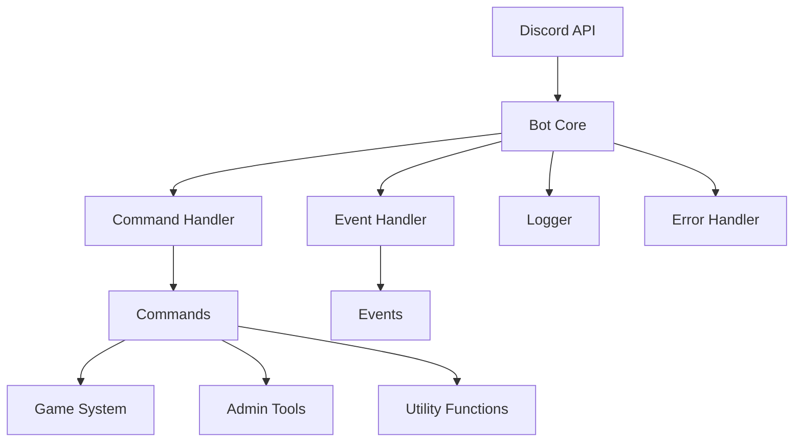

# Bot Architecture

## Overview
Milena uses a modular architecture with dependency injection and service-oriented design. The bot is built with scalability, maintainability, and performance in mind.

## Directory Structure
```
src/
├── commands/          # Command implementations
│   ├── admin/        # Administrative commands
│   ├── fun/         # Entertainment commands
│   ├── games/       # Game commands
│   └── utility/     # Utility commands
├── config/           # Configuration files
├── core/            # Core bot functionality
│   ├── BaseCommand.js    # Command base class
│   ├── EventManager.js   # Event handling
│   └── Logger.js        # Logging system
├── data/            # Persistent data storage
├── games/           # Game implementations
│   ├── GameBase.js      # Base game class
│   ├── GameManager.js   # Game management
│   └── [game].js       # Individual games
└── utils/           # Utility functions
```

## Core Components

### Command System
- **BaseCommand Class**: Template for all commands
  - Permission handling
  - Cooldown management
  - Error handling
  - Analytics tracking
- **Command Categories**:
  - Admin: Server management
  - Fun: Entertainment features
  - Games: Interactive games
  - Utility: Helper functions

### Game System
- **GameBase Class**: Template for all games
  - State management
  - Player handling
  - Turn management
  - Error recovery
- **GameManager**: Central game coordinator
  - Game lifecycle
  - Resource management
  - Player matching
  - State persistence

### Logging System
- **Multi-level Logging**:
  - Debug: Development information
  - Info: General operations
  - Warn: Potential issues
  - Error: Critical problems
  - Audit: Security events
- **Log Management**:
  - Automatic rotation
  - Compression
  - Retention policies
  - Performance metrics

### Error Handling
- **Graceful Recovery**:
  - Command failures
  - Network issues
  - API limits
  - Resource constraints
- **Error Tracking**:
  - Stack traces
  - Context capture
  - User impact
  - Recovery actions

## Performance Optimization
- **Resource Management**:
  - Memory usage monitoring
  - CPU utilization tracking
  - Network bandwidth control
  - Cache optimization
- **Scaling Considerations**:
  - Command throttling
  - Resource pooling
  - Load distribution
  - Automatic cleanup

## Security Measures
- **Access Control**:
  - Role-based permissions
  - Command restrictions
  - Resource limits
  - Input validation
- **Monitoring**:
  - Audit logging
  - Usage patterns
  - Error tracking
  - Performance metrics

## Data Management
- **Storage Types**:
  - In-memory cache
  - File system
  - Configuration
  - Game states
- **Data Lifecycle**:
  - Creation
  - Validation
  - Persistence
  - Cleanup

<!-- 
Internal Development Notes:
- Consider implementing Redis for better caching
- Monitor memory usage during game sessions
- Implement automatic backup system
- Add performance benchmarking
- Consider containerization for easier deployment
-->

## Deployment Architecture


## Performance Requirements
- Response Time: < 100ms for commands
- Memory Usage: < 512MB baseline
- CPU Usage: < 30% average
- Network: < 1MB/s bandwidth
- Storage: < 1GB total

## Scaling Considerations
- Maximum concurrent games: 10
- Maximum users per server: 100
- Maximum commands per minute: 100
- Maximum log size: 100MB per day
